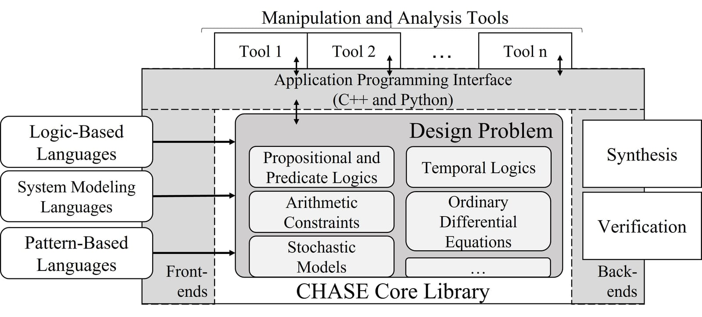

The Contract-based Heterogeneous Analysis and System Exploration (CHASE) framework is a
requirement engineering framework combining specification and modeling formalisms with rigorous
verification and synthesis procedures relying on A/G contracts.

CHASE also provides interfaces for the designers to implement novel design tools and
methodologies.

*The core library represents the contracts; front-end and back-end tools are built on its APIs.*

Its main component is the representation core library, which provides a set of classes to
represent requirements, components, and system models in terms of A/G contracts. Contracts are
then mathematical models with rigorous composition rules that provide mechanisms to analyze
system behaviors, validate design requirements, and develop system components in a modular and
hierarchical way. The CHASE library supports the representation of A/G contracts expressed in
propositional logic or Linear Temporal Logic (LTL) and implements the operations defined by the
contract algebra. Thus, it allows exploiting the compositionality and rigor provided by A/G
contracts and their algebra to automate verification and synthesis tasks. The library also
supports the representation of Signal Temporal Logic and Metric Temporal Logic, enabling the use
of the most appropriate formalism for the specification of the design requirements. Finally,
CHASE supports the representation of arithmetic constraints on real numbers, dynamical systems
in the state space, and probability distributions to specify stochastic components and
probabilistic constraints.

A set of methods allow accessing the functionalities of the core library to manipulate the design
representations. These methods are exported to designers by C++ and Python Application
Programming Interfaces (APIs). Design methodologies can be implemented on top of CHASE by
writing tools that exploit these APIs.

Front-end and back-end tools can also be developed on top of the CHASE library. Front-end tools
are used to aid the formalization of the requirements, usually expressed in semi-formal
languages, by encoding them in the formal constructs of the core library. Back-end tools
interface the internal representation provided by the core library to external solvers.
