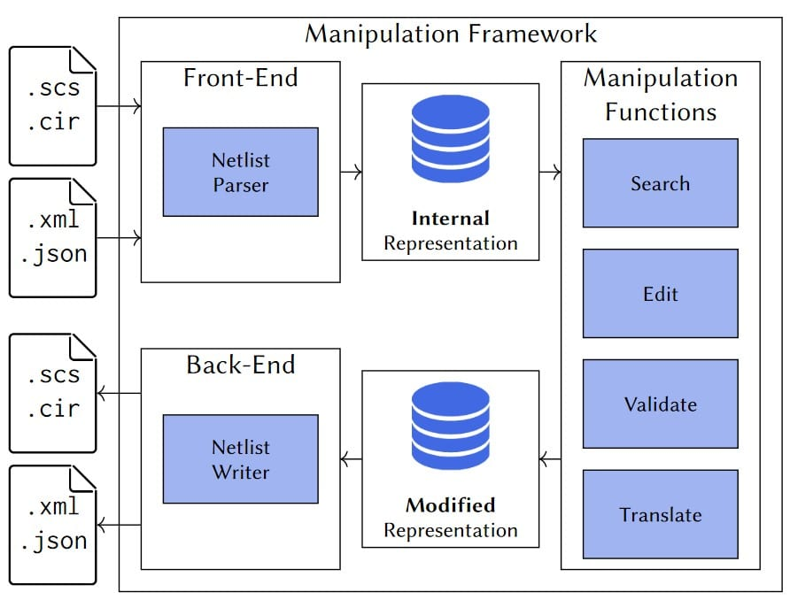
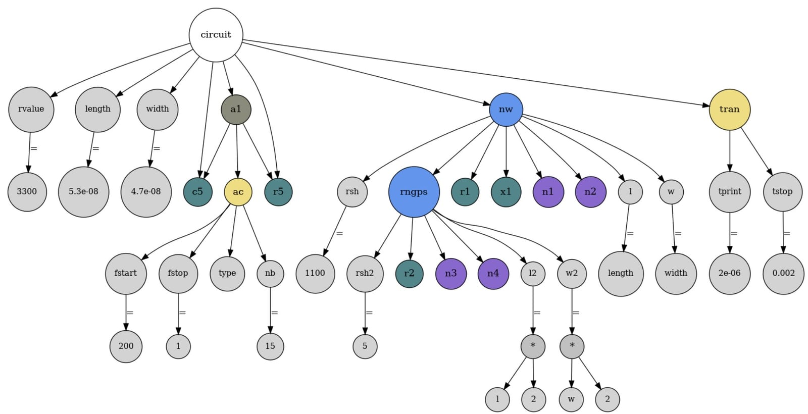

## A common semantic layer for SPICE-family netlists

Transistor-level design flows use many SPICE-derived languages. They often describe closely related circuit concepts while differing in syntax, supported constructs and tool-specific conventions. **EDACurry** addresses that fragmentation with a shared internal semantic model: language-specific front ends parse a netlist into one **abstract syntax tree (AST)**, tools manipulate that representation, and back ends emit the desired target language.

The result is not simply a source-to-source converter. The common AST creates an intermediate layer on which analysis and transformation tools can be written once and reused across supported netlist formats.

*A language-specific front end creates the common AST; manipulation tools operate on that representation before a back end emits the target netlist.*

## Conversion and manipulation workflows

The current framework supports SPICE-family languages including **Eldo and Spectre**. Its core is implemented in C++, while Python access makes the same representation available to scripts and higher-level workflows. Public descriptions of EDACurry document operations including **design-space exploration, defect-model injection and subcircuit wrapping**, as well as integration with commercial and open-source simulation flows.

The architecture exposes APIs together with visitor/listener-style mechanisms so users can implement transformations without rewriting a parser. This separation is important in analog and mixed-signal design automation, where the same structural operation may need to be applied to netlists originating from different tools.

## Serialisation and tool chaining

EDACurry can serialise its in-memory representation through a JSON back end and reconstruct it through the corresponding front end. That creates a neutral interchange point for chaining independent tools: one stage can parse and transform a netlist, another can operate on the serialised representation, and a later stage can regenerate the desired circuit language.

A companion visualisation workflow converts the JSON representation into DOT/GraphViz form, making the internal structure inspectable as a tree.

*The common representation can be serialised and visualised as a tree, which is useful for inspecting and debugging transformations.*

## Scalability and current implementation

The public EDACurry repository includes scalability experiments for Eldo and Spectre netlists with up to **200,000 components**. The reported measurements show approximately linear growth in parsing and writing time over those benchmarks, with near-constant per-device cost. The repository also contains the grammars, parser/manipulation sources, auxiliary tools and tests used by the project.

A 2025 IEEE Transactions on Computer-Aided Design of Integrated Circuits and Systems article presents the current framework and its applications, including Python-accessible custom transformations and interoperability with analog-design tools. The maintained public repository is now hosted by the `esd-univr` organisation.

## Availability

EDACurry is distributed under the **MIT License**. The repository contains the source code, build and contribution information, tests and benchmark material.

## Official resources

- [EDACurry source repository](https://github.com/esd-univr/EDACurry)
- [2025 IEEE TCAD article](https://doi.org/10.1109/TCAD.2025.3647373)
