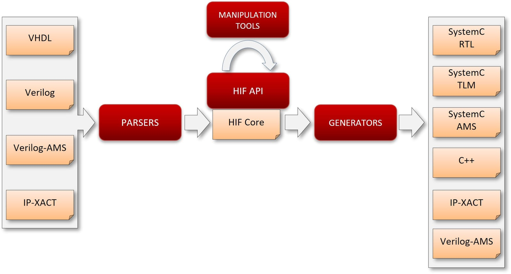

HIFSuite is a set of tools and application programming interfaces (APIs) that provide support
for modeling and verification of HW/SW systems. The core of HIFSuite is the HDL Intermediate
Format (HIF) language upon which a set of front-end and back-end tools have been developed to
allow the conversion of HDL code into HIF code and vice versa. HIFSuite allows designers to
manipulate and integrate heterogeneous components implemented by using different hardware
description languages (HDLs). Moreover, HIFSuite includes tools, which rely on HIF APIs, for
manipulating HIF descriptions in order to support code abstraction/refinement and
post-refinement verification. Moreover, through the manipulation tools it is possible to inject
different types of faults to generate faulty models.

*HIF sits between the front-end and back-end tools, so any supported language can be read and written.*
