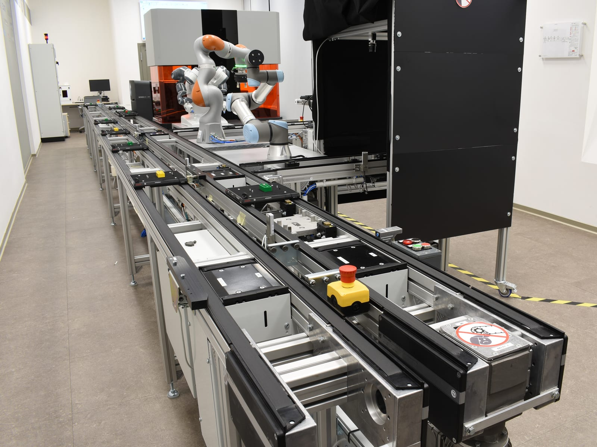
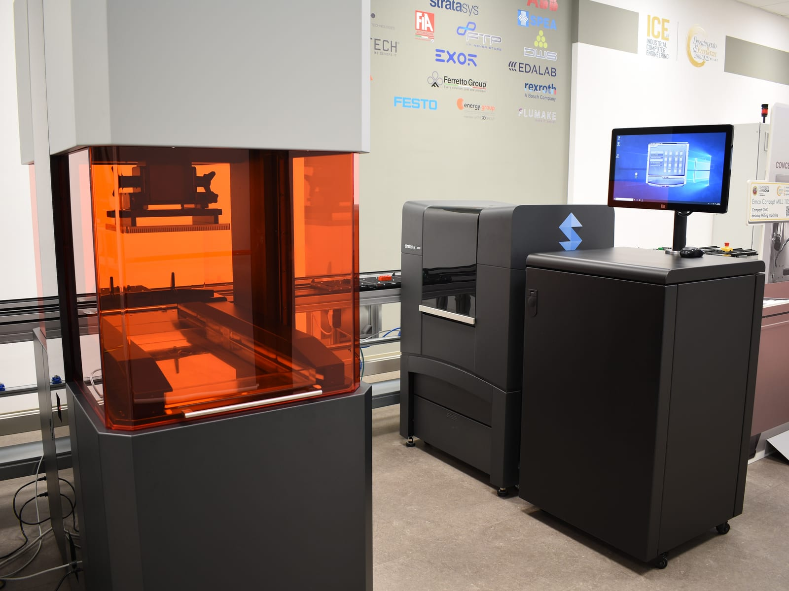
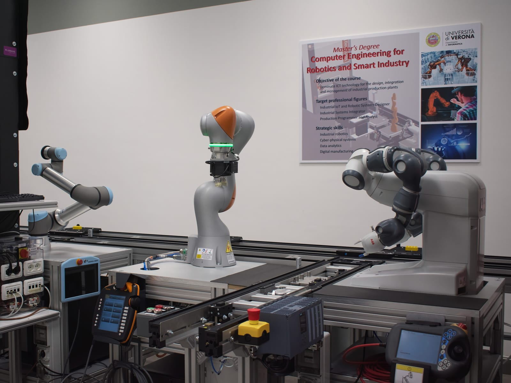
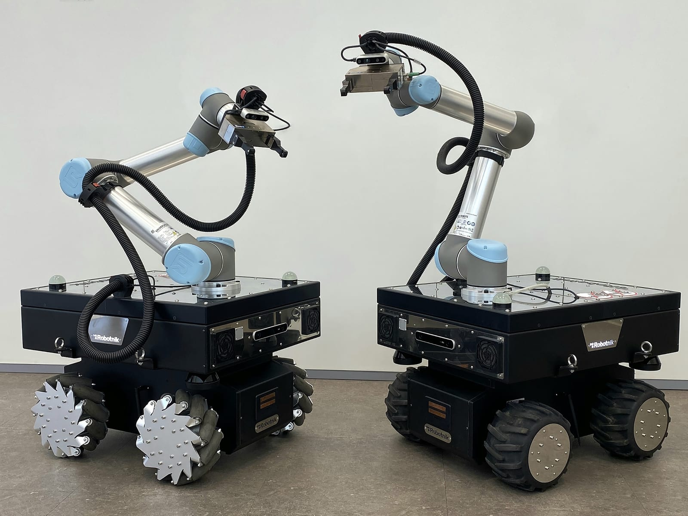
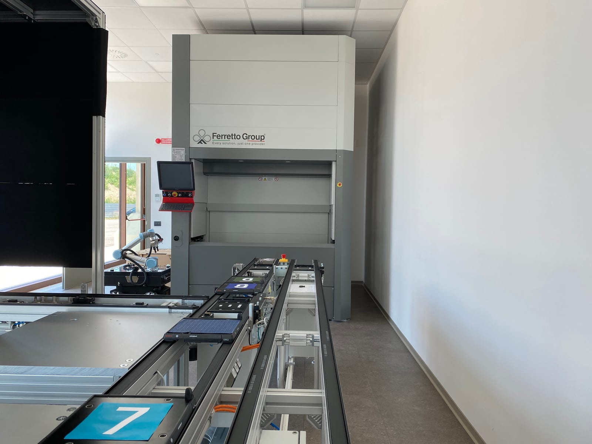

## A full-scale Industry 4.0/5.0 demonstrator

The **Industrial Computer Engineering (ICE) Laboratory** is a University of Verona research, education and technology-transfer facility built around a reconfigurable production line. It provides a controlled environment in which researchers, students and companies can integrate industrial machinery, robots, sensors and software without having to experiment directly on a production plant.

The laboratory was created within the University's excellence initiative for information technology and Industry 4.0, supported by the Italian Ministry of Education, Universities and Research. Its purpose is broader than a single manufacturing demonstrator: the University identifies ICE as a reference facility for research on **cyber-physical systems, robotics, image processing and production-oriented data analysis**, with applications in logistics and production management. The current institutional plan is to develop ICE further as an inter-departmental laboratory.

*The reconfigurable production line links manufacturing, assembly, inspection, logistics and storage stations. Photo: Simone Girardi*

## Manufacturing and inspection cells

The physical line covers several complementary production stages. **Functional testing** is provided by a SPEA Flying Probe 4020 S2 electronic-board tester. **Subtractive manufacturing** uses an EMCO ConceptMill 105 CNC milling machine integrated with the laboratory automation stack, while **additive manufacturing** includes DWS Systems X PRO S and Stratasys J826 printers.

Assembly is built around collaborative robotics. An **ABB YuMi IRB14000** and a **KUKA LBR iiwa 14 R820** operate in the assembly area under a Siemens S7-1500 safety PLC. The PLC also exposes OPC UA connectivity, allowing the physical cell to participate directly in the laboratory's service-oriented software architecture.

*Additive-manufacturing equipment beside the production line. Photo: Simone Girardi*

*Collaborative robotic assembly integrated with the conveyor and plant control infrastructure. Photo: Simone Girardi*

The visual-quality-control area combines industrial cameras and three-dimensional inspection. The laboratory documents a **Basler camera**, a **Gocator laser scanner**, an edge-computing system with CPU/GPU processing, and a **Universal Robots UR5e** manipulator that presents workpieces to the inspection system. Processing results can be exposed to the rest of the line through OPC UA.

## Logistics and storage

Material movement is part of the experiment rather than an external utility. A **Bosch Rexroth minipallet conveyor** transports and tracks workpieces between cells and can be reconfigured without a fixed route. Two **Robotnik RB-KAIROS 5 mobile manipulators**, based on ROS and equipped with UR5 arms, can move autonomously between stations and support automated loading of production equipment.

A **Ferretto Group VERTIMAG EF** vertical warehouse provides automated storage and retrieval. ICE uses the storage system not only operationally but also as a platform for studying optimisation strategies for part placement and production recipes.

*Mobile manipulators provide autonomous material handling between production cells. Photo: Simone Girardi*

*The VERTIMAG vertical warehouse integrates storage and retrieval with the production flow. Photo: Simone Girardi*

## Software-defined production

The line is tied together by a software and communication stack rather than by isolated machine controllers. **Siemens Opcenter Execution Discrete** provides Manufacturing Execution System functionality. A **Meta-MES developed at ICE** works alongside it and the data infrastructure to react to changes in plant status and production plans, using machine functions exposed through a service-oriented architecture. Communication between manufacturing areas is centred on **OPC UA**.

The laboratory also operates two complementary digital-twin modes in **Siemens Tecnomatix Plant Simulation**. The connected twin, described by ICE as a **Digital Shadow**, follows the real line through the machines' OPC UA interfaces. The autonomous twin runs independently for simulation, statistics, configuration studies, timing optimisation and experiments involving equipment that is not yet physically integrated.

## Industrial data infrastructure

ICE treats the information infrastructure as part of the cyber-physical system. Its data-collection architecture uses **Kubernetes, microservices and CI/CD** to collect, monitor and store data from laboratory equipment and IoT/IIoT sensors. The architecture can aggregate logs and alerts, perform preprocessing and selectively connect data to cloud services while retaining an extensible on-premises platform.

IoT gateways integrate environmental and energy measurements with existing industrial signals. The laboratory documents sensing for temperature, humidity, brightness, presence, air quality and machine energy consumption, with OPC UA used to make collected information available to the wider control and monitoring infrastructure.

## Research, teaching and technology transfer

ICE is used as a common physical platform for research on digital twins, production-system modelling, scheduling and reconfiguration, industrial communications, machine vision, robotics, data analysis and human interaction with cyber-physical factories. Laboratory teaching in the University's computer-engineering programmes uses the production plant directly, while companies can use ICE to demonstrate and evaluate technologies in a controlled industrial setting.

A 2024 VRST demonstration illustrates this research role through a high-fidelity **virtual-reality digital twin of the ICE facility**, allowing users to explore the laboratory and inspect live or simulated machine information from an immersive representation.

## Official resources

- [ICE Laboratory website](https://www.icelab.di.univr.it/?lang=en)
- [Laboratory equipment and infrastructure](https://www.icelab.di.univr.it/laboratory/?lang=en)
- [University of Verona institutional facility record](https://www.dimi.univr.it/?ent=bibliocr&id=359&lang=en&tipobc=4)
